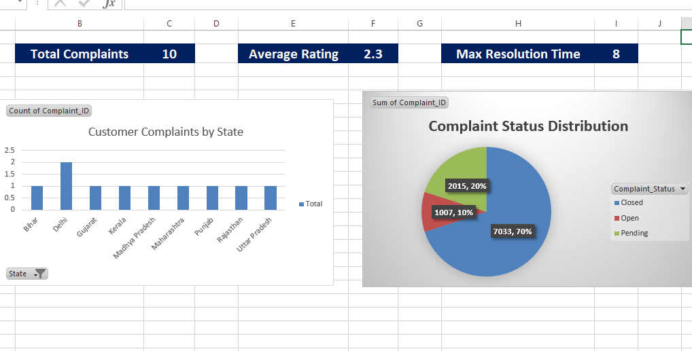
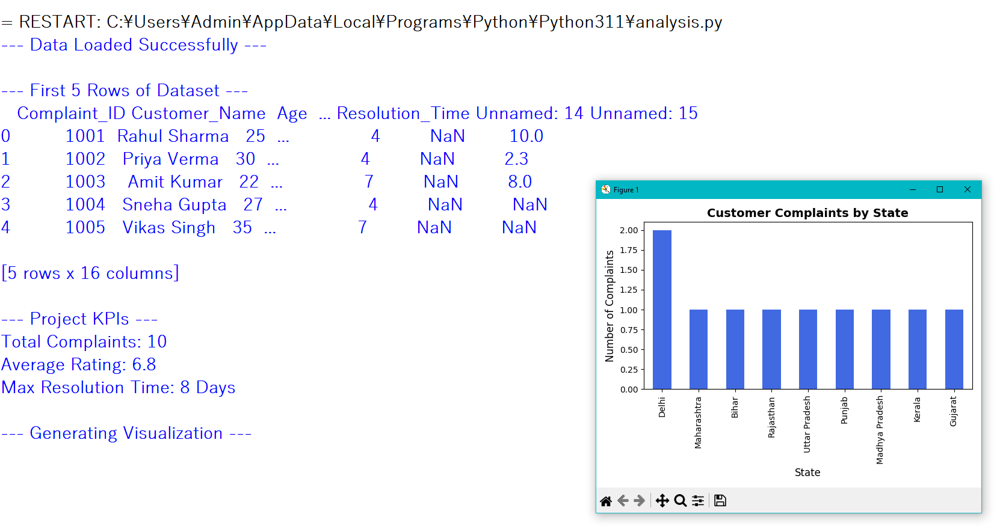
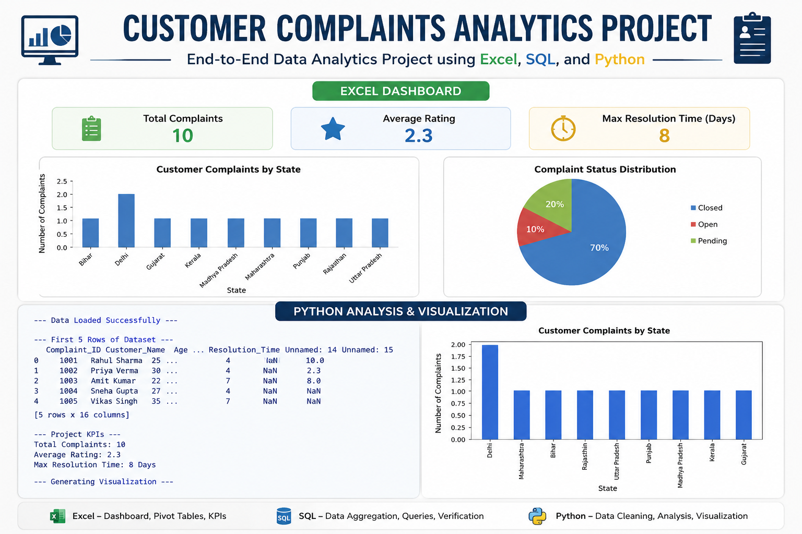

# Customer Complaints Data Analytics Project

An end-to-end Data Analytics project demonstrating data cleaning, validation, analysis, and visualization using **Excel, SQL, and Python**.

---

## 📌 Project Overview

The objective of this project is to analyze customer complaint data and generate meaningful business insights. The project focuses on understanding complaint patterns, monitoring customer satisfaction, and evaluating operational efficiency through dashboards, SQL validation, and Python-based analysis.

This project demonstrates how business metrics can be calculated and validated across multiple tools to ensure data consistency and accuracy.

---

## 🛠️ Tech Stack Used

### 📊 Excel
- Data Cleaning
- Pivot Tables
- KPI Cards
- Interactive Dashboard
- Slicers & Filters

### 🗄️ SQL
- Data Aggregation
- KPI Validation
- GROUP BY Queries
- COUNT(), AVG(), MAX()

### 🐍 Python
- Pandas
- Matplotlib
- Data Analysis
- Data Visualization

---

## 📊 Key Performance Indicators (KPIs)

The following KPIs were calculated and validated across Excel, SQL, and Python:

| KPI | Value |
|------|------|
| Total Complaints | 10 |
| Average Customer Rating | 2.3 / 5.0 |
| Maximum Resolution Time | 8 Days |

---

## 📈 Excel Dashboard



### Dashboard Features

- Customer Complaints by State
- Complaint Status Distribution
- KPI Cards
- Interactive Filters and Slicers
- Business Performance Tracking

### Tasks Performed

- Imported and cleaned raw data
- Created Pivot Tables
- Built KPI cards
- Added interactive slicers
- Designed dashboard for stakeholder reporting

---

## 🗄️ SQL Verification

SQL was used to validate the metrics generated through Excel and Python analysis.

### Total Complaints by State

```sql
SELECT State,
       COUNT(Complaint_ID) AS Total_Complaints
FROM complaints_table
GROUP BY State;
```

### Average Customer Rating

```sql
SELECT AVG(Customer_Rating) AS Average_Rating
FROM complaints_table;
```

### Maximum Resolution Time

```sql
SELECT MAX(Resolution_Time) AS Max_Resolution_Time
FROM complaints_table;
```

### Complaint Status Distribution

```sql
SELECT Complaint_Status,
       COUNT(*) AS Total_Count
FROM complaints_table
GROUP BY Complaint_Status;
```

### SQL Concepts Used

- SELECT
- COUNT()
- AVG()
- MAX()
- GROUP BY
- Data Aggregation
- KPI Validation

The SQL results were compared against Excel and Python outputs to ensure consistency and accuracy.

---

## 🐍 Python Analysis & Visualization



### Tasks Performed

- Loaded dataset using Pandas
- Inspected and verified data
- Calculated KPIs
- Performed complaint trend analysis
- Created visualizations using Matplotlib

### Python Libraries Used

```python
import pandas as pd
import matplotlib.pyplot as plt
```

### KPIs Generated Using Python

- Total Complaints
- Average Customer Rating
- Maximum Resolution Time
- Complaint Distribution by State

---

## 🔄 Project Workflow

### Step 1: Data Collection
- Imported customer complaint dataset.

### Step 2: Data Cleaning
- Checked missing values.
- Validated dataset structure.

### Step 3: Excel Dashboard Creation
- Built Pivot Tables.
- Created KPI cards.
- Added charts and slicers.

### Step 4: SQL Validation
- Verified metrics through aggregation queries.
- Cross-checked dashboard outputs.

### Step 5: Python Analysis
- Processed data using Pandas.
- Generated insights and visualizations using Matplotlib.

### Step 6: Reporting
- Compared outputs from Excel, SQL, and Python.
- Generated final business insights.

---

## 📸 Project Summary



This infographic provides a consolidated overview of the complete analytics workflow including Excel Dashboard creation, SQL verification, KPI tracking, and Python visualization.

---

## 🔍 Key Insights

- Total complaints recorded: **10**
- Average customer rating: **2.3 / 5**
- Maximum resolution time: **8 days**
- Complaint distribution varies across states.
- Dashboard and SQL results matched successfully.
- Python analysis confirmed all KPI calculations.

---

## 💡 Skills Demonstrated

- Data Cleaning
- Data Validation
- Data Analysis
- Exploratory Data Analysis (EDA)
- Excel Dashboard Development
- SQL Query Writing
- KPI Reporting
- Data Visualization
- Pandas
- Matplotlib
- Business Analytics

---

## 🎯 Learning Outcomes

Through this project, I strengthened my skills in:

- Excel Dashboarding
- SQL Aggregation Queries
- Python Data Analysis
- Data Visualization
- Business KPI Tracking
- End-to-End Analytics Workflow

---

## 👩‍💻 Author

**Prachi Narula**

Aspiring Data Analyst | Excel | SQL | Python | Data Visualization

🔗 GitHub Repository:
https://github.com/prachi-dataanalyst/Customer-Complaints-Analytics
